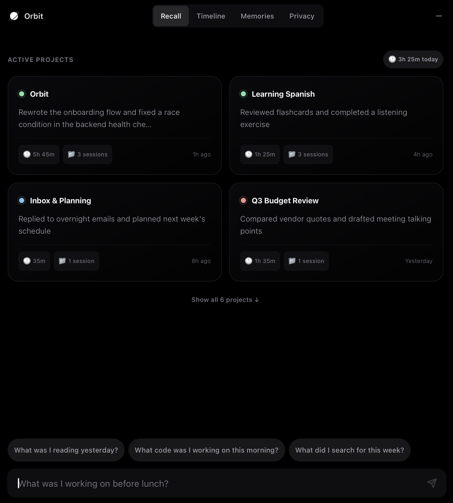
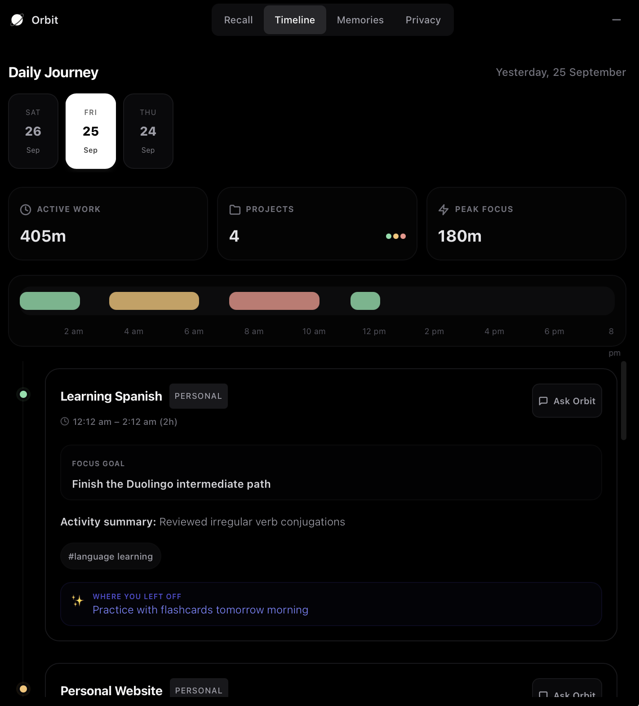
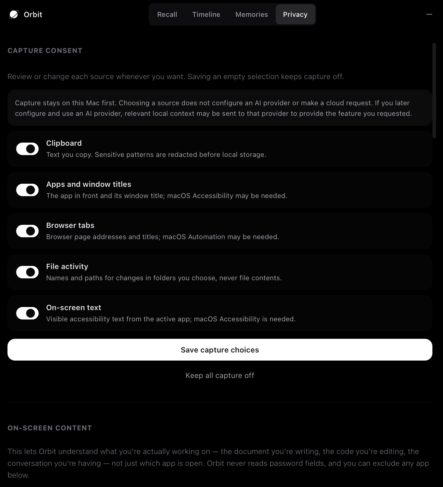
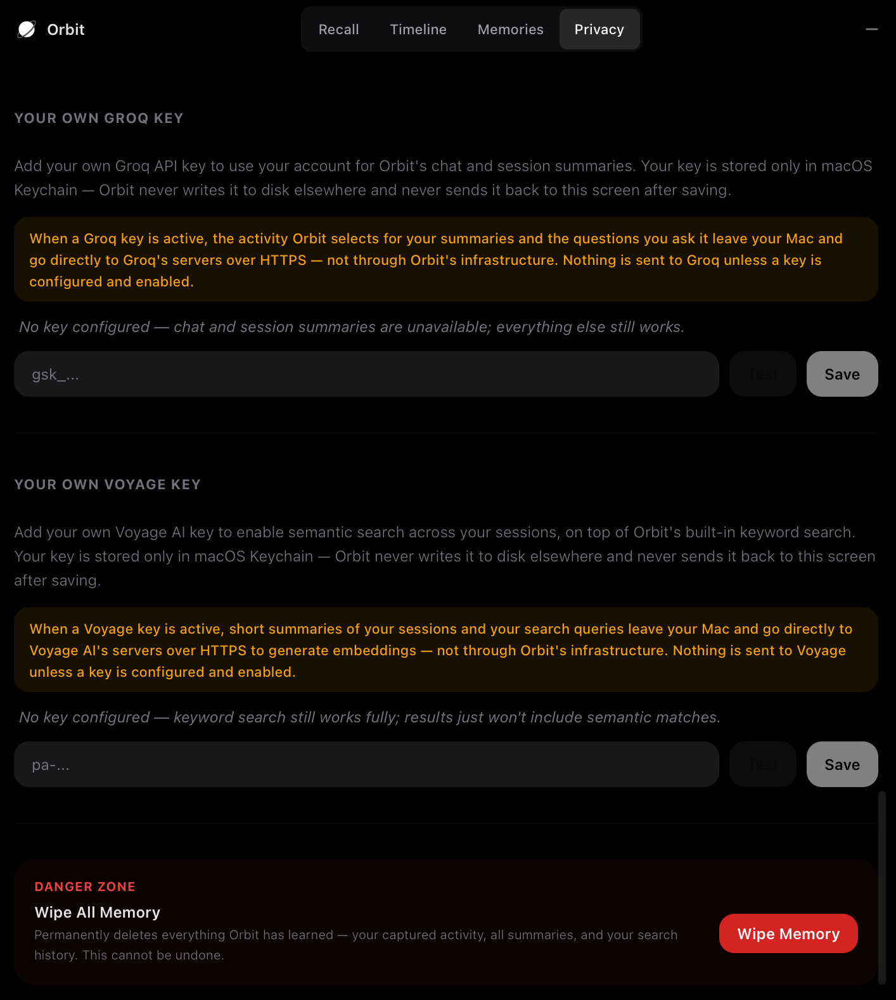

# Orbit

**"I help you continue."** Orbit is a macOS menu-bar app that quietly watches
what you work on — which apps, windows, files, and pages — and turns it into
searchable memory, so you can ask "what was I doing yesterday?" or "where did
I leave that project?" in plain language and get a real answer.

It's not a second brain and it's not a productivity system. It's working
memory that builds itself, for anyone who uses a computer — not just
developers.

## Status

Beta (`v0.2.4`). Core capture, recall, and privacy controls work day to day.

This is a self-build, source-only project — there are no prebuilt
downloads, no signed releases, and no auto-updater (see
[Building from source](#building-from-source)). Since you build it
yourself on your own Mac, there's no Gatekeeper "unidentified developer"
warning to work around — that quarantine flag only applies to files
downloaded from the internet, not to an app you compile locally. If you go
on to distribute a build you made to *other people*, code-signing and
notarization become your responsibility, using your own Apple Developer
account; nothing in this repo does that for you.

## What Orbit does

Every 30 minutes, Orbit turns your recent activity into a short AI-written
summary — what you were working on, where you left off, what (if anything)
you seemed stuck on. Ask it a question and it searches that memory (plus
raw keyword search, which always works, even fully offline) and gives you a
specific answer: real file names, real URLs, real project names, not a
generic "you worked on some code."

<p align="center">
  
  
</p>

*(Session content above is placeholder data for illustration — Orbit writes
its own summaries from what it actually observes.)*

## What it captures, and what it never does

Orbit runs entirely on your Mac. Everything below is stored locally in
`~/.orbit/` (SQLite, plus a local vector index if you've enabled semantic
search); nothing is captured until you explicitly turn each category on.

**Captured, only for categories you've enabled:**
- The active app and window title
- Clipboard content (secrets — API keys, private keys, credit card and SSN
  patterns, crypto addresses — are redacted *before* anything touches disk)
- Browser tab URLs and titles (native, via a permission you grant — no
  browser extension required, though one exists for richer capture)
- On-screen text of the app you're focused on, via macOS's Accessibility API
- File activity in folders you choose to watch (the file *path* and
  action only — file contents are never read)
- System events: screen lock/unlock, sleep/wake (used to figure out where
  one work session ends and the next begins)

**Never captured, unconditionally, no setting changes this:**
- Anything typed into a password field (`AXSecureTextField` is skipped at
  every level of the Accessibility API traversal, before any text is read)
- Keystrokes, key codes, or mouse coordinates — idle-time detection uses
  only a timer (seconds since last input), never what was typed or clicked
- Microphone or screen-recording capture (both are future, unbuilt phases;
  neither exists in the current app)
- Network traffic, DNS queries, or HTTP bodies
- Content from password managers or banking apps (excluded by default —
  you can exclude any other app or website too)

You can pause capture at any time, exclude specific apps or websites,
review and delete any individual captured item, or wipe everything with one
click. Nothing is captured before you complete the first-launch consent
screen, which asks about each capture category independently — there's no
single "accept all" that turns on more than you intended.

<p align="center">
  
</p>

## Cloud AI is fully optional (bring your own key)

Orbit's AI-written summaries and its chat-style recall use Groq. **There is
no maintainer-funded shared key.** If you don't add your own Groq API key,
Orbit still works fully — keyword search over your local activity always
works, with no network request of any kind. Add your own key (Privacy tab →
Your Own Groq Key, stored only in macOS Keychain) to get AI-written
summaries and conversational recall; add a Voyage AI key too if you also
want semantic ("search by meaning, not exact words") recall. Either key is
optional and independently removable.

When a key is active, the content Orbit selects for a summary or a recall
answer goes directly from your Mac to that provider's own servers over
HTTPS — never through any server Orbit's maintainer runs or pays for. **You
control and pay for your own usage; the maintainer never sees your API
usage or bill.**

No telemetry, analytics, or crash reporting of any kind is sent anywhere,
by anyone, ever — not even anonymized.

<p align="center">
  
</p>

## Building from source

Requires macOS 13 (Ventura) or later, plus Xcode Command Line Tools, Rust,
Node.js/pnpm, and Python (`uv`). Three independent workspaces — `AGENTS.md`
at the repo root has the full architecture reference; this is the short
version.

```bash
git clone https://github.com/Saadaan-Hassan/orbit.git
cd orbit
```

**Desktop app** (Tauri v2 + React + Rust) — run in dev mode:
```bash
cd app && pnpm install && pnpm tauri dev
```

Or build a real, installable (unsigned) `.app`/`.dmg` you can drag into
Applications:
```bash
cd app && pnpm install && pnpm tauri build
```

**Backend** (FastAPI, Python, `uv` — never `pip`) — only needed standalone
if you're working on backend code directly; `pnpm tauri dev`/`build` above
already handles spawning it for the desktop app:
```bash
cd backend && uv sync
uv run uvicorn main:app --reload --port 47821
```

**Landing site** (static Next.js export, no backend of its own):
```bash
cd landing && pnpm install && pnpm dev
```

**Chrome extension** (optional, for richer browser capture — the app
already captures browser URLs natively without it):
```bash
cd extension && pnpm install && pnpm build
```
Then load it unpacked: `chrome://extensions` → Developer mode → Load
unpacked → select `extension/dist`.

On first launch, Orbit walks you through granting Accessibility permission
(for window tracking) and, optionally, Automation permission (for native
browser URL capture) and the capture-consent screen described above.

Run each workspace's own checks before sending a change — see
`CONTRIBUTING.md` for the full list (lint/typecheck/test per workspace,
Rust fmt/Clippy, and security/license scanning). Short version:

```bash
cd backend && uv run ruff check . && uv run mypy . && uv run python -m unittest discover -s tests -p 'test_*.py'
cd app/src-tauri && cargo fmt --check && cargo clippy --all-targets -- -D warnings && cargo test --bin app
cd app && pnpm typecheck && pnpm lint && pnpm test && pnpm build
cd extension && pnpm typecheck && pnpm test && pnpm build
cd landing && pnpm lint && pnpm build
```

## Known limitations

- macOS only (13 Ventura or later). Windows support is a planned future
  phase, not built yet.
- Source-only, no prebuilt downloads or auto-updates — see
  [Building from source](#building-from-source).
- AI features (summaries, chat recall, semantic search) require you to
  bring your own Groq/Voyage API key — there's no free tier funded by the
  maintainer, by design (see [Cloud AI](#cloud-ai-is-fully-optional-bring-your-own-key)).
- On-screen text capture depends on macOS's Accessibility API, which
  doesn't expose content from every app equally well (some apps render
  their own text rather than using accessible UI elements).
- Semantic recall requires a Voyage AI key specifically; without one,
  recall still works, just via keyword search only.

## Links

- [License](LICENSE) — Apache-2.0
- [Third-party notices](THIRD_PARTY_NOTICES.md) — dependency license review
- [Privacy policy](https://heyorbit.saadaan.dev/privacy)
- [Open-source readiness roadmap](OPEN_SOURCE_ROADMAP.md) — the audit trail
  for this project's path to being public; also doubles as a running list of
  what's done and what's left
- [Contributing guide](CONTRIBUTING.md) — setup, task selection, tests,
  privacy rules, and DCO sign-off
- [Security policy](SECURITY.md) — supported versions and private
  vulnerability reporting
- [Code of Conduct](CODE_OF_CONDUCT.md)
- [Support](SUPPORT.md) and [Governance](GOVERNANCE.md)

## License

Apache License, Version 2.0 — see [LICENSE](LICENSE). Orbit is provided
"AS IS", without warranties or conditions of any kind, express or implied.
See the license text for the full disclaimer.
