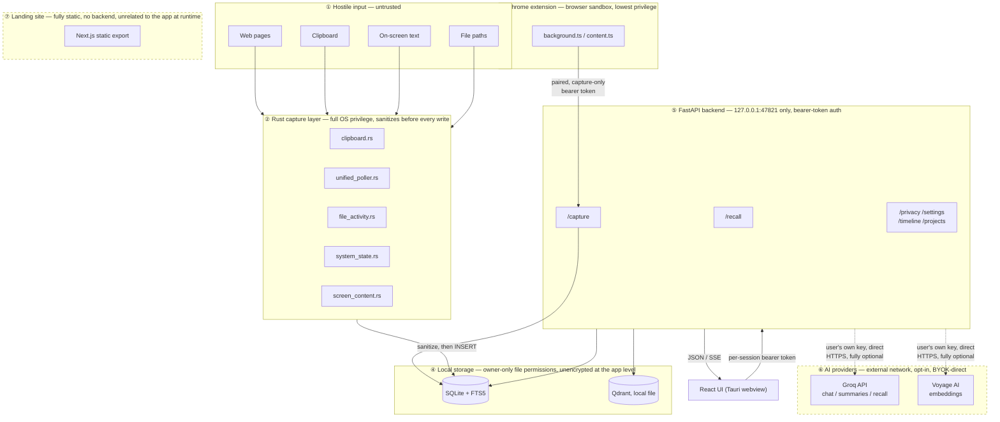
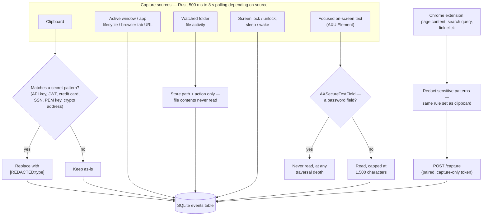
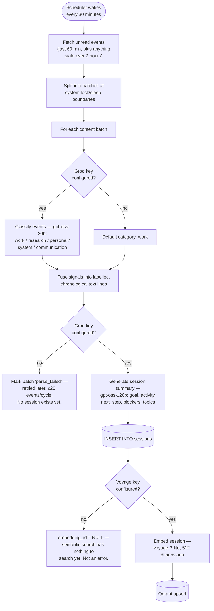
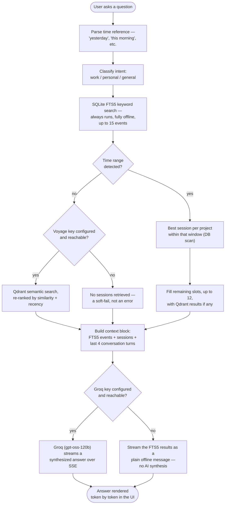

# Orbit Architecture

This is the external-facing architecture reference — trust boundaries, data
flow, and where to look for more detail. `AGENTS.md` at the repo root is the
canonical, most-detailed reference (file-by-file responsibilities, exact
schemas, every implementation constant) and is kept current as the code
changes; this document is the higher-level map that points into it, plus the
things a security reviewer or new contributor would ask first. See
[`THREAT_MODEL.md`](THREAT_MODEL.md) for what's defended against and
[`PRIVACY_DATA_FLOW.md`](PRIVACY_DATA_FLOW.md) for exactly what data moves
where.

## What Orbit is

A macOS menu-bar app that passively captures activity (active app/window,
clipboard, browser URLs, on-screen text, file activity, system state),
turns it into local searchable memory, and answers natural-language recall
queries about it. Everything runs on the user's own Mac. Cloud AI (Groq for
summaries/recall, Voyage AI for semantic search) is entirely optional,
bring-your-own-key, and called directly from the user's machine to the
provider — **no maintainer-run server of any kind sits in between, and none
exists for this project at all.**

## Distribution model

Source-only, self-build. Anyone who wants to run Orbit clones this repo and
builds it themselves (`pnpm tauri dev` or `pnpm tauri build`) — see the root
[`README.md`](../README.md). There is no packaged release, no auto-updater,
no companion release repository, and no Chrome Web Store listing. This
matters for the threat model: a released-binary supply chain (build server
compromise, signing key theft, update-channel hijack) simply isn't a
category of risk here, because that pipeline doesn't exist. See `AGENTS.md`'s
`Distribution` section for the full reasoning, and `OPEN_SOURCE_ROADMAP.md`'s
`ADR-000` ("Accepted target architecture") and its 2026-09-26 update note
for the decision record.

## Trust boundaries

Each layer below is a distinct trust boundary — code in one layer should
never assume code in another has already validated something for it.

1. **Hostile input surface** — web pages the user visits, clipboard content,
   on-screen text, file names. None of this is trusted. Sanitization happens
   here, before anything is written to disk.
2. **Rust capture layer** (full OS access, highest privilege) —
   `clipboard.rs`, `unified_poller.rs`, `file_activity.rs`,
   `system_state.rs`, `screen_content.rs` — writes directly to SQLite. Runs
   with whatever OS permissions the user has granted (Accessibility,
   Automation). Every writer sanitizes before `INSERT` (ADR-003) and is
   gated on per-category consent (`PRIV-*`).
3. **Chrome extension** (browser sandbox, lowest privilege) — runs inside
   Chrome's extension sandbox, not the OS. Can only reach the backend via a
   paired, capture-only bearer token scoped to exactly one route
   (`/capture`) — never the app's own session token. See ADR-001 (local API
   auth) and SEC-004.
4. **Local storage** (SQLite + FTS5 + Qdrant, all on-disk, unencrypted at the
   app level — relies on FileVault for disk encryption) — `~/.orbit/`,
   owner-only file permissions (0600/0700, ADR-004). No network exposure of
   any kind — nothing outside this Mac can reach it directly.
5. **FastAPI backend** (loopback-only, authenticated) — binds
   `127.0.0.1:47821` only. Every route requires a per-session bearer token
   generated fresh by Rust at launch, validated against exact Host/Origin —
   see ADR-001, SEC-002/003.
6. **AI providers** (external network boundary, opt-in) — Groq
   (chat/summaries/recall) and Voyage AI (embeddings), called directly with
   the user's own key — BYOK, no maintainer infrastructure. Only
   already-redacted content is ever sent. With no personal key, this
   boundary is never crossed at all.
7. **Landing site** (fully static, no backend) — Next.js static export. No
   database, no email service, no waitlist, no server-side code of any kind
   (SITE-001).

## Monorepo layout

Four independent workspaces — see `AGENTS.md`'s `Monorepo Structure` for the
full file-by-file tree:

| Workspace | What it is | Trust boundary above |
|---|---|---|
| `app/` | Tauri v2 desktop app: React frontend + Rust backend (capture, IPC, sidecar management) | 1, 2, 5 |
| `backend/` | FastAPI (Python) — recall, session generation, provider calls, local API auth | 5, 6 |
| `extension/` | Chrome extension (Manifest V3), optional richer browser capture | 3 |
| `landing/` | Static Next.js marketing site | 7 |

## Application workflows

Three things happen while Orbit runs: capture (continuous), background
session generation (every 30 minutes), and recall (on demand, when the user
asks a question). Each is a fully separate pipeline — a failure or missing
key in one never blocks the others.

### 1. Capture — from the OS/browser to SQLite

Every source above is independently gated on per-category consent and the
global pause switch — nothing here runs before the user has explicitly
granted it (`PRIV-002`). Native capture (everything except the extension)
writes to SQLite directly from Rust; the extension is the only capture path
that goes over HTTP, and only to the one authenticated `/capture` route.

### 2. Background session generation — every 30 minutes

Without a Groq key, raw events still accumulate and are still fully
searchable via FTS5 keyword search — but no session summaries, Timeline
entries, or Project Cards are ever produced, since all three read from the
`sessions` table, not raw events. This is the one place a missing key
changes what the app can show, not just how it answers a question.

### 3. Recall — answering a user's question

Two independent fallback tiers, by design (`ADR-006`): a missing or
unreachable Voyage key only removes semantic search — Groq still
synthesizes an answer from FTS5 and any DB-scanned sessions. Only a
Groq-side failure (no key, network down, rate-limited) drops all the way to
the plain-text offline message, since that's the only step that actually
requires the network. A `work`-intent query additionally excludes
`category = 'personal'` events from the FTS5 results; `personal` and
`general` queries see everything.

## Further reading

- [`THREAT_MODEL.md`](THREAT_MODEL.md) — what's defended against, and what
  isn't
- [`PRIVACY_DATA_FLOW.md`](PRIVACY_DATA_FLOW.md) — every captured field,
  where it's sanitized, what (if anything) leaves the device
- `docs/adr/` — one ADR per material architecture decision (local API auth,
  versioned consent, Rust sanitization, canonical exclusions/Keychain
  storage, Tauri shell hardening, lazy semantic search, telemetry removal)
- Root `AGENTS.md` — the canonical, exhaustive reference this document
  summarizes; read it before making any architectural change
- `OPEN_SOURCE_ROADMAP.md` — the audit trail for how this project reached
  its current security/privacy posture, including decisions that
  superseded earlier ones (e.g., the 2026-09-26 pivot to source-only
  distribution)
